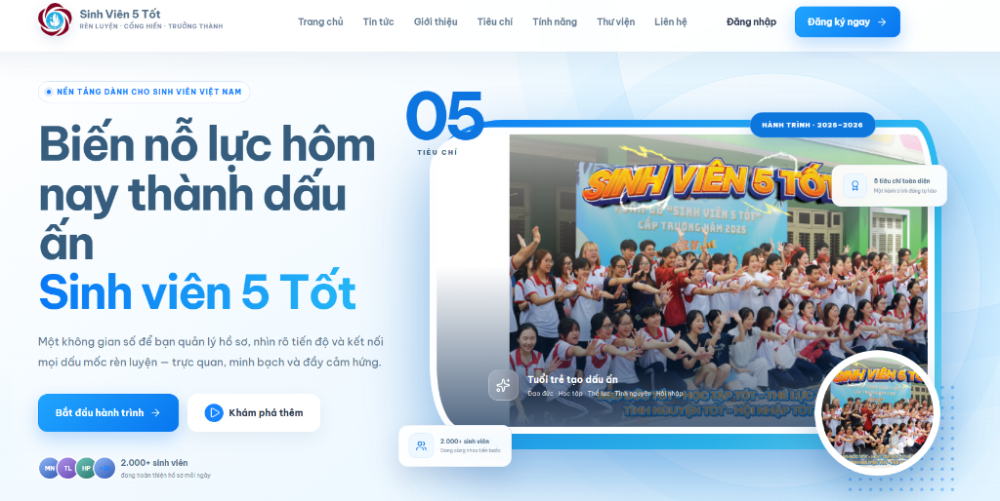
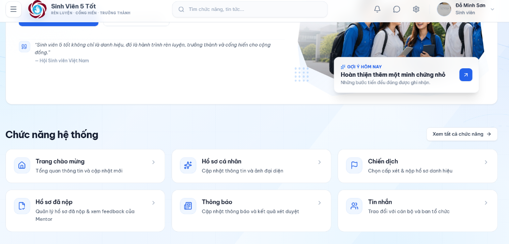
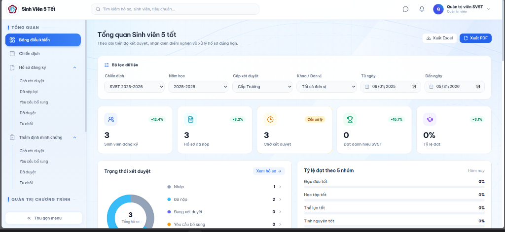

# 🎓 SV5T - HỆ THỐNG QUẢN LÝ & XÉT DUYỆT "SINH VIÊN 5 TỐT"

> Nền tảng Fullstack số hóa toàn diện quy trình đăng ký, thẩm định minh chứng và xét chọn danh hiệu *"Sinh Viên 5 Tốt"* các cấp theo chuẩn Hội Sinh viên Việt Nam.

[](https://dotnet.microsoft.com/)
[](https://react.dev/)
[](https://www.typescriptlang.org/)
[](https://redis.io/)
[](https://www.mysql.com/)
---

## 📸 Giao diện Hệ thống (Screenshots)
| Trang chủ (Landing Page) | Cổng Sinh viên (Student Portal) | Bảng điều khiển Quản trị (Admin) |
| :---: | :---: | :---: |
|  |  |  |
---

## 📌 Bối cảnh & Mục tiêu
Giải pháp chuyển đổi số thay thế quy trình nộp và thẩm định hồ sơ giấy/file rời rạc truyền thống:
- **Sinh viên:** Nộp hồ sơ trực tuyến theo cây tiêu chí, xem trước minh chứng PDF/ảnh và theo dõi tiến độ thời gian thực.
- **Hội đồng Thẩm định (Reviewer):** Workspace chấm duyệt tập trung, phản hồi lý do bổ sung và lưu vết lịch sử đánh giá.
- **Quản trị viên (Admin):** Quản lý cấu hình bộ tiêu chuẩn linh hoạt theo năm học, điều phối chiến dịch và thống kê KPIs.
---

## 🛠️ Công nghệ Sử dụng (Tech Stack)
| Phân tầng | Công nghệ chính |
| :--- | :--- |
| **Backend** | ASP.NET Core 9 (C# 13), Clean Architecture, Polly 8 (Retry + Exponential Backoff) |
| **Database & Cache** | MySQL 8.0 (Pomelo EF Core 9 + Dapper), Redis 7 (Cache, Sliding Rate Limit, Streams) |
| **Frontend** | React 19, TypeScript, Vite, TanStack Query v5, Zustand, Tailwind CSS, MUI, react-pdf |
| **Dịch vụ & Giao tiếp** | SignalR Core (Realtime Chat/Noti), Cloudinary (Storage), Brevo SMTP (MailKit), Docker |

---

## 🚀 Điểm nhấn Kỹ thuật (Engineering Highlights)

### 1. Kiến trúc Backend & Tối ưu Truy vấn (.NET 9)
- **Chuẩn Clean Architecture 4 tầng**: Tách biệt độc lập [`Domain`](./src/SV5T.Domain) $\rightarrow$ [`Application`](./src/SV5T.Application) $\rightarrow$ [`Infrastructure`](./src/SV5T.Infrastructure) $\rightarrow$ [`Api`](./src/SV5T.Api); xem chi tiết tại [docs/architecture.md](./docs/architecture.md).
- **Mô hình Hybrid ORM (EF Core 9 + Dapper)**: EF Core xử lý ghi dữ liệu, quan hệ phức tạp và migration; Dapper tối ưu hóa các truy vấn đọc báo cáo, dashboard và phân trang lớn để tối đa hóa throughput.
- **Khả năng phục hồi (Resilience)**: Tích hợp Polly triển khai Retry Pattern với Exponential Backoff & Jitter cho các kết nối ngoại vi (SMTP, Redis).

### 2. Bảo mật & Quản lý Danh tính Đa tầng
- **Dual-Token Authentication**: Access Token ngắn hạn (15m, stateless) kết hợp Refresh Token lưu trong cookie `HttpOnly`, `Secure`, `SameSite=Strict` (chỉ lưu hash SHA-256 ở database).
- **Token Reuse Detection & Family Revocation**: Định danh chuỗi refresh qua `FamilyId`. Khi phát hiện token cũ đã thu hồi bị gửi lại (replay attack), hệ thống tự động hủy toàn bộ Token Family của phiên làm việc.
- **Bảo mật chuyên sâu**: Cơ chế Idle Timeout (120m), mã hóa AES dữ liệu nhạy cảm bằng ASP.NET Core Data Protection, và xác thực tệp upload qua Magic Number binary header.

### 3. Xử lý Bất đồng bộ & Hàng đợi (Redis Streams Outbox)
- **Transactional Outbox với Redis Streams**: Đẩy toàn bộ tác vụ gửi OTP và thông báo sang Background Worker xử lý bất đồng bộ qua Consumer Group, giúp API phản hồi tức thì không bị chặn bởi tác vụ mạng ngoại vi.
- **Dead-Letter Queue (DLQ) & Quota Control**: Tự động chuyển message lỗi vượt số lần retry vào DLQ; quản lý hạn mức gửi email hàng ngày và dành riêng hạn ngạch khẩn cấp cho luồng cấp lại mật khẩu.

### 4. Realtime & Trò chuyện Trực tuyến
- **Kênh hỗ trợ trực tiếp SignalR**: Module Chat thời gian thực giữa Sinh viên và Cán bộ xét duyệt, đồng bộ trạng thái đã đọc và thông báo đẩy khi hồ sơ có cập nhật mới.

### 5. Frontend Modular & Tối ưu Hiệu năng (React 19)
- **Feature-Driven Architecture**: Cấu trúc thành 15 modules độc lập tại [`frontend/src/features/`](./frontend/src/features) (tách biệt types, services, hooks, components); chuẩn hóa Thin Pages (< 150 dòng).
- **Tối ưu Bundling & Server State**: Dynamic Imports (`React.lazy`) giảm initial bundle từ 1.78 MB xuống 1.05 MB (~41%); TanStack Query v5 tối ưu hóa caching và revalidation.
- **Trình xem minh chứng tích hợp**: Tích hợp `react-pdf` kết hợp Cloudinary xem trực tiếp PDF/ảnh trên trình duyệt.

### 6. Nghiệp vụ Tiêu chuẩn & Đảm bảo Chất lượng (QA)
- **Cây tiêu chí đa cấp**: Cấu hình logic đánh giá linh hoạt (`All`, `Any`, `AtLeast`), quy trình nộp - phản hồi - bổ sung minh chứng đa trạng thái và kiểm toán toàn diện (`ReviewLog`, `AdminAuditLog`).
- **Kiểm thử tự động**: Xây dựng 112 Unit Tests hoàn chỉnh tại [`tests/SV5T.UnitTests`](./tests/SV5T.UnitTests) (xUnit, Moq, FluentAssertions) kiểm thử 100% logic xác thực, token rotation, mã hóa PII và nghiệp vụ xét duyệt.

---

## 🔐 Luồng Xác thực & Token Rotation
```text
Client (React)                         Server (ASP.NET Core)                  Redis / Database
     │                                          │                                     │
     ├── 1. POST /api/auth/register ───────────>│── Lưu OTP Challenge (TTL 180s) ────>│ Redis
     │                                          │── Push Email Outbox Message ───────>│ Redis Stream
     │                                          │                                     │ (Worker gửi qua Brevo)
     ├── 2. POST /api/auth/verify-otp ─────────>│── Xác thực OTP & tạo User ─────────>│ MySQL
     │                                          │                                     │
     ├── 3. POST /api/auth/login ──────────────>│── Kiểm tra mật khẩu (BCrypt)        │
     │                                          │── Cấp Access Token (JWT 15m)        │
     │                                          │── Cấp Refresh Token (FamilyId) ────>│ MySQL (SHA-256)
     │<── Set-Cookie: refreshToken (HttpOnly) ──│                                     │
     │                                          │                                     │
     ├── 4. Khi Access Token hết hạn ──────────>│                                     │
     │    POST /api/auth/refresh                │── Kiểm tra Idle Timeout (120m)      │
     │    (Kèm Cookie Refresh Token)            │── Thu hồi Token cũ, cấp Token mới ─>│ MySQL
     │<── Trả Access Token mới + Cookie mới ────│    (Giữ nguyên FamilyId)            │
     │                                          │                                     │
     │    [CẢNH BÁO: TÁI SỬ DỤNG TOKEN CŨ]      │                                     │
     ├── Token đã rotate bị gửi lại ───────────>│── Phát hiện Token Reuse!           │
     │<── 401 Unauthorized ─────────────────────│── Thu hồi TOÀN BỘ Family Tokens ───>│ MySQL (Revoke All)
```

---

## 📁 Cấu trúc Thư mục
```text
SV5T/
├── src/
│   ├── SV5T.Domain/          # Entities, Enums, Value Objects, Domain Events
│   ├── SV5T.Application/     # Use Cases, DTOs, Service Interfaces & Logic
│   ├── SV5T.Infrastructure/  # EF Core, Dapper, Redis Streams, Cloudinary, Polly
│   └── SV5T.Api/             # REST API Controllers, SignalR Hubs, Middlewares
├── frontend/
│   ├── src/
│   │   ├── features/         # 15 modules tính năng độc lập (Feature-Driven)
│   │   ├── components/       # Layout & Reusable UI components
│   │   └── store/            # Client Auth State (Zustand)
│   └── package.json
├── tests/
│   └── SV5T.UnitTests/       # 112 Unit Tests (xUnit + Moq + FluentAssertions)
├── docs/                     # Tài liệu kiến trúc & screenshots
└── compose.yaml              # Docker Compose cấu hình Redis 7 AOF
```

---

## ⚙️ Hướng dẫn Cài đặt & Khởi chạy (Local Development)

- **Yêu cầu:** [.NET 9 SDK](https://dotnet.microsoft.com/download/dotnet/9.0) | [Node.js 20+](https://nodejs.org/) | [MySQL 8.0+](https://dev.mysql.com/) | [Docker Desktop](https://www.docker.com/)

### Các bước thực hiện
1. **Khởi tạo biến môi trường:**
   ```powershell
   Copy-Item .env.example .env
   Copy-Item src/SV5T.Api/.env.example src/SV5T.Api/.env
   Copy-Item frontend/.env.example frontend/.env
   ```
2. **Khởi động Redis & Cập nhật CSDL:**
   ```powershell
   docker compose up -d
   dotnet ef database update --project src/SV5T.Infrastructure/SV5T.Infrastructure.csproj --startup-project src/SV5T.Api/SV5T.Api.csproj
   ```
3. **Khởi chạy Backend API (.NET 9):**
   ```powershell
   dotnet run --project src/SV5T.Api/SV5T.Api.csproj
   # Swagger UI: http://localhost:5080/swagger
   ```
4. **Khởi chạy Frontend (React 19):**
   ```powershell
   npm --prefix frontend install
   npm --prefix frontend run dev
   # Ứng dụng: http://localhost:5173 (Thông tin đăng nhập xem tại docs/run_project.txt)
   ```

---

## 👤 Tác giả

- **Họ và tên:** Đỗ Minh Sơn
- **GitHub:** [@Son2k5](https://github.com/Son2k5)
- **Repository:** [Son2k5/SinhVien5Tot](https://github.com/Son2k5/SinhVien5Tot)
- **Email:** sonct2k3@gmail.com
